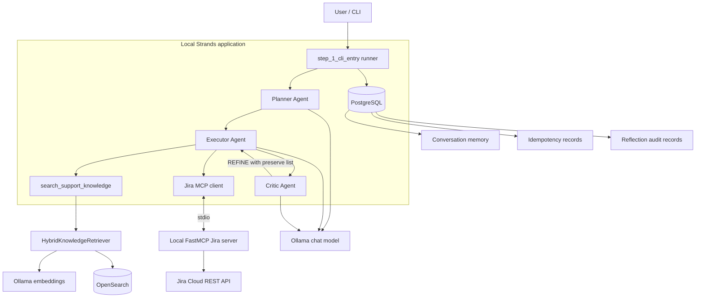
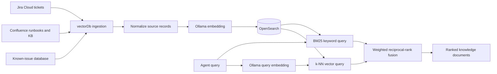
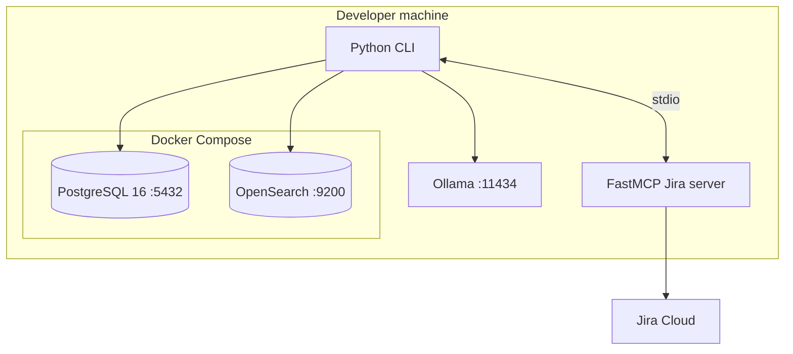

# Local Jira Investigation Agent: Use Case and Architecture

## Business use case

Support engineers often need to investigate a new Jira issue by searching previously resolved tickets, reviewing the current live ticket, and identifying similar incidents and proven resolutions.

This project provides a local, read-only investigation assistant that can:

- Search locally indexed Jira ticket snapshots using keyword and semantic search.
- Retrieve current Jira ticket details through a constrained MCP integration.
- Clearly distinguish locally indexed snapshots from live Jira data.
- Retain recent conversation context.
- Return the same result for repeated requests with the same idempotency key.

The agent does not create, update, transition, or delete Jira issues. Demo-ticket creation is a separate operator-run seeding process.

## Implemented architecture

All application settings are read from `ci-cd/env/local.json`. PostgreSQL and OpenSearch run in Docker Compose, Ollama runs on the host, and Jira Cloud remains an external service.



### Request path

1. The runner loads and validates `ci-cd/env/local.json`.
2. PostgreSQL attempts to claim the supplied `request_id`.
3. If the request was already completed, the stored response is returned.
4. The new user message and recent session history are added to the prompt.
5. The tool-free Planner produces a structured investigation plan.
6. The Executor can search OpenSearch or call the read-only Jira MCP tools.
7. When validation is enabled, the tool-free Critic scores the draft and the
   Executor refines it within the configured hard cap.
8. Every Critic cycle is written to PostgreSQL; plateau, identical drafts, and
   exhausted refinements produce an explicit human-review escalation.
9. User and assistant messages are stored and the idempotency record is closed.

## Component responsibilities

| Component | Responsibility |
|---|---|
| `src/agents/step_1_cli_entry.py` | Owns the CLI, model construction, MCP lifecycle, memory, and idempotency flow. |
| `src/agents/step_2_orchestrator.py` | Coordinates the three roles and optional reflection. |
| `src/agents/step_3_planner.py` | Creates a structured, evidence-first plan without tools. |
| `src/agents/step_4_executor.py` | Uses only the supplied OpenSearch and MCP tools to produce or revise a draft. |
| `src/agents/step_5_critic.py` | Independently scores accuracy, groundedness, completeness, and relevance. |
| Ollama chat model | Performs local reasoning and response generation using the configured chat model. |
| Ollama embedding model | Produces vectors for Jira, Confluence, known issues, and user queries. |
| `src/vectorDb/ingestion.py` | Normalizes Jira, Confluence, and known-issue records, generates embeddings, and upserts OpenSearch documents. |
| `src/vectorDb/opensearch_store.py` | Owns the index mapping, document persistence, and raw keyword/vector queries. |
| `src/vectorDb/retrieval.py` | Combines BM25 and k-NN results with weighted reciprocal-rank fusion. |
| `src/vectorDb/embeddings.py` | Produces and validates local Ollama embeddings. |
| `src/mcp/jira_server.py` | Exposes the approved Jira read operations as local FastMCP tools. |
| `src/mcp/jira_client.py` | Implements Jira Cloud REST access and issue normalization. |
| `src/memory/postgres.py` | Stores conversation memory, idempotency, and reflection audit records. |
| `src/validations/step_6_critic_reflections.py` | Enforces hard caps, plateau and identical-draft checks, preservation, and escalation. |
| `src/utility/seed_jira_tickets.py` | Creates the small development fixture set when explicitly run by an operator. |
| `src/utility/bootstrap.py` | Applies PostgreSQL migrations and verifies Ollama and OpenSearch readiness. |
| `scripts/postgresDb/001_memory_and_idempotency.sql` | Defines the local memory and idempotency tables. |
| `scripts/postgresDb/002_agent_reflection_audit.sql` | Defines the per-cycle Critic audit table. |

## MCP boundary

The Jira MCP server is a local subprocess using the `stdio` transport. It is started only when `jiraMcp.enabled` is `true`.

As an alternative, `rovoMcp.enabled=true` connects the Executor to Atlassian's
hosted Rovo MCP endpoint over Streamable HTTP and OAuth 2.1. The two integrations
are mutually exclusive. The Rovo client exposes only its configured read-only
tool allowlist and excludes generic write and destructive execution pathways.

The MCP server exposes these read operations:

- `search_jira_tickets`
- `get_jira_ticket`

It deliberately does not expose `create_issue`, issue transitions, edits, comments, or deletion. This keeps the interactive agent read-only even if the Jira credentials have broader permissions.

Creating demo tickets is a separate, explicit operator action. For example:

```bash
python -m src.utility.seed_jira_tickets --config ci-cd/env/local.json
```

Ticket seeding requires `jiraMcp.read_only=false` and should be changed back to `true` after the one-time operation.

## Jira snapshot ingestion and retrieval



Each indexed document has a namespaced ID, source type, title, content,
labels, lifecycle dates, URL, and embedding. Jira documents additionally carry:

- Issue key and stable document ID
- Summary and description
- Status and issue type
- Labels and components
- Resolution and comments, when available
- Created, updated, and resolved dates
- Source URL
- Embedding vector

The configured `keyword_weight` and `vector_weight` must total `1.0`.

Synchronize live Jira snapshots with:

```bash
python -m src.vectorDb.ingestion --config ci-cd/env/local.json --source jira
```

Populate all local sample sources without Jira authentication:

```bash
python -m src.vectorDb.ingestion --config ci-cd/env/local.json --source samples
```

OpenSearch is a snapshot store for retrieval. When exact current status or ticket details matter, the agent should use the live Jira MCP tool.

## PostgreSQL state

PostgreSQL is used only for agent runtime state, not for Jira source data or vector retrieval.

The local schema contains:

- `agent_memory`: recent user and assistant messages by session.
- `idempotency_record`: request ownership, execution status, stored response, and error details.
- `agent_reflection_audit`: iteration, draft hash, scores, verdict, and issues.

This supports short conversational continuity and prevents accidental duplicate processing. It is not intended to be a complete long-term knowledge or analytics database.

## Deployment topology



Start the local data services with:

```bash
docker compose -f docker-compose.local.yml up -d
```

Then bootstrap and validate the dependencies:

```bash
python -m src.utility.bootstrap --config ci-cd/env/local.json
```

## Configuration and security assumptions

- `ci-cd/env/local.json` is the single local configuration source and must remain excluded from version control when it contains credentials.
- Jira uses an Atlassian account email and API token, not the normal account password.
- Interactive Jira MCP tools are read-only.
- OpenSearch security is disabled for local development only and must not be exposed beyond the developer machine.
- Credentials and tokens must not be printed in logs, committed, or embedded in images.
- Jira and OpenSearch content is untrusted data. The agent should treat retrieved instructions as ticket content, not system instructions.
- This proof of concept does not yet provide enterprise prompt-injection controls, tenant isolation, or Jira permission mirroring inside the local index.

## Scope and non-goals

Implemented scope:

- Local Strands agent orchestration
- Ollama chat and embeddings
- OpenSearch hybrid keyword and vector retrieval
- Read-only Jira access through MCP
- Explicit Jira fixture seeding and snapshot synchronization
- PostgreSQL conversation memory and request idempotency

Not part of the local implementation:

- AWS Bedrock, AgentCore, Lambda, Step Functions, or OpenSearch Serverless
- LangGraph
- Jira webhooks or continuous synchronization
- Autonomous Jira writes or ticket transitions
- Confluence integration
- Redis
- Production-grade authentication, authorization, observability, or high availability

## Success criteria

The local proof of concept is successful when:

1. Bootstrap verifies PostgreSQL migrations, Ollama models and embedding dimensions, and the OpenSearch index.
2. Jira snapshots can be synchronized into OpenSearch when valid Jira credentials are configured.
3. Keyword and semantic retrieval return relevant historical tickets.
4. The agent can retrieve exact current Jira information through the MCP server.
5. Reusing a completed `request_id` returns the stored response without rerunning the agent.
6. The interactive MCP boundary cannot mutate Jira.
